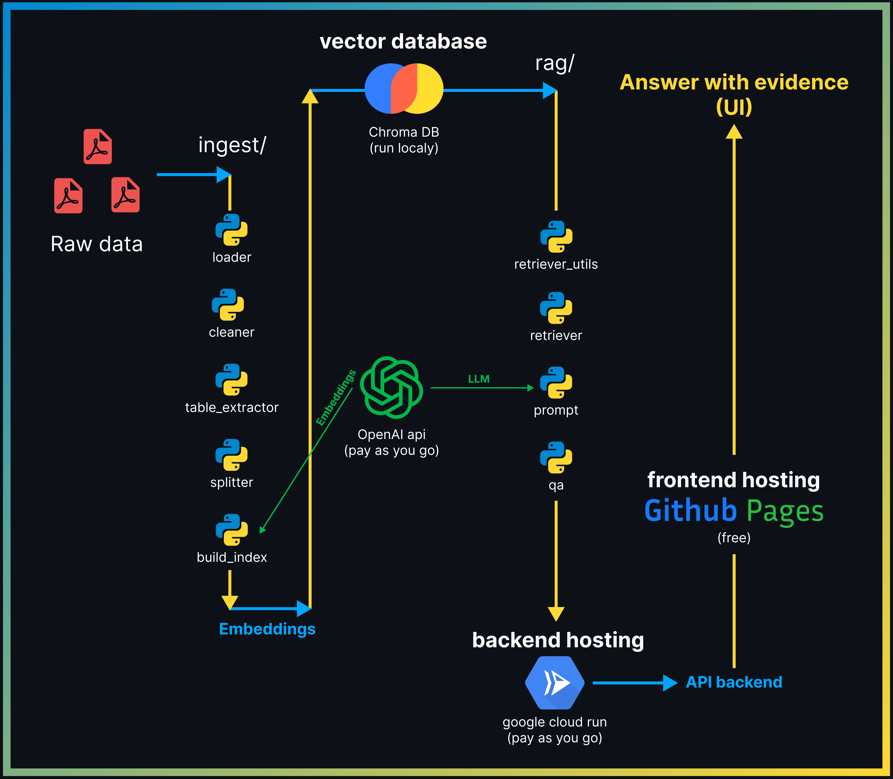

*“This project uses publicly available financial reports from Alicorp S.A.A. The documents are included for educational and demonstration purposes only.”*

# Financial RAG QA Assistant | Full-Stack Web App
A complete full-stack Retrieval-Augmented Generation (RAG) web app for financial Q&A over audited statements, answering only from provided evidence with document-level traceability.

**Live Demo ->** `[SOON!!!]`

## Architecture Overview

## Project Structure
- `data/`: Contains the datasets used by the RAG pipeline, including raw and processed PDFs.
    - `processed/`: Preprocessed data generated from raw documents, including extracted text and chunked content prepared for embedding and indexing in ChromaDB.
    - `raw/`: Original financial documents (PDFs) in human-readable format, used as the primary source of truth.
---
- `src/`: Source code files for the application.
    - `ingest/`: Ingestion and preprocessing logic for extracting high-quality text chunks from raw financial PDFs.
        - **build_index.py**: Generates embeddings from chunks and persists them into the ChromaDB vector store (offline ingestion).
        - **cleaner.py**: Short script wich cleans and normalizes raw PDF text, reducing layout noise while preserving financial values.
        - **loader.py**: Loads raw PDFs and extracts page-level text with document and page metadata for traceable RAG ingestion.
        - **splitter.py**: Converts page text into overlapping chunks while preserving page-level traceability.
        - **table_extractor.py**: Logic to extract table content from PDFs as faithfully as possible.
    - `rag/`: Core RAG logic.
        - **prompt.py**: Prompt templates and strict grounding rules for evidence-based financial QA (anti-hallucination + citation policy).
        - **qa.py**: RAG QA orchestrator that retrieves evidence, builds grounded context, calls the LLM, and returns the final answer with citations.
        - **retriever_utils.py**: Parses the user question to infer intent (doc type, year/period, audit signals) and builds metadata filters (`where`)
        - **retriever.py**: Fetches top_k most relevant chunks from ChromaDB for a user question, applying metadata filters.
    - **config.py**: Central configuration for runtime settings (paths, models, top_k, batch size).
---
- `vector_store/`: Vector database files used by the RAG pipeline. *Ignored by Git but included in Docker builds*
- **.dockerignore**: Files and directories excluded from the Docker build context.
- **.gitignore**: Files and folders ignored by Git.
- **app.py**: Main backend application logic.
- **debug_cli.py**: Command-line script for local debugging and testing.
- **Dockerfile**: Docker image definition for containerized deployment.
- **LICENSE**: Project license.
- **requirements.txt**: Python dependencies for the project. Install with: *pip install -r requirements.txt*

## Things I’m Paying For
- **Google cloud run**: Backend deployment. (pay-as-you-go).
- **OpenAI API key**: Embeddings and LLM responses for user queries. (pay-as-you-go).

